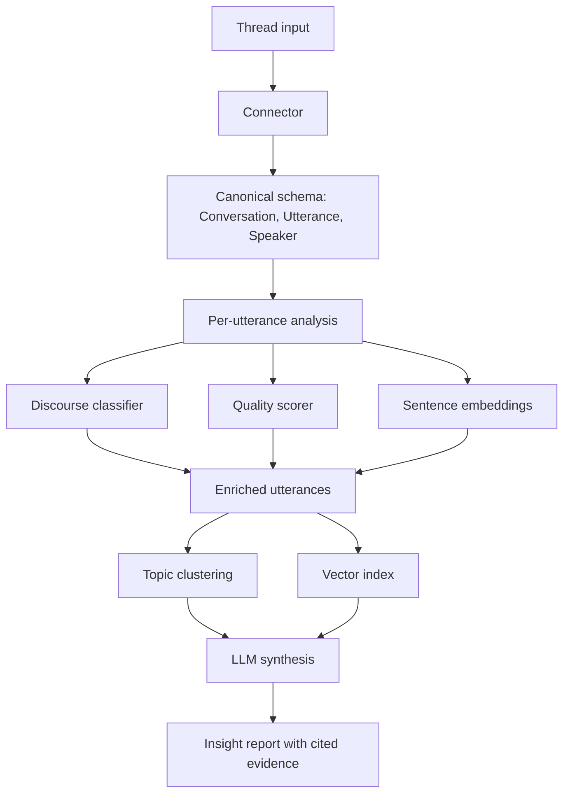

# Discussion Intelligence Toolkit

An open-source Python toolkit for turning long asynchronous discussions into structured, evidence-linked insight reports.

This repository is both the team’s working project space and the final public portfolio artifact. Students will build the package, notebooks, experiments, evaluation results, documentation, and final report here throughout Break Through Tech AI Studio Fall 2026. Keep this README current as the project evolves; by December, it should read as the project’s public technical report.

## Start Here

1. Read `Challenge-Project-Overview.md` for the full challenge brief, milestones, and advisor expectations.
2. Create or review the GitHub Projects board for monthly milestone tracking.
3. Use `notebooks/` for exploration, modeling, and demo notebooks.
4. Use `data/` only for small metadata files or documented pointers. Do not commit large raw datasets, model checkpoints, API keys, or `.env` files.
5. Track setup blockers, modeling decisions, and evaluation questions as GitHub issues.
6. Update this README whenever the team changes datasets, modeling approach, metrics, or project scope.

## What We Are Building

Long Reddit, forum, Discord, GitHub, and community discussions contain product, research, and operational signal that is expensive to extract manually. This project builds a Python toolkit that ingests threaded conversations and produces structured reports showing:

- the main claims and arguments in a discussion
- the comments that support each claim
- discourse-act labels such as question, answer, agreement, disagreement, humor, and elaboration
- argument-quality or discussion-quality scores
- discovered topic clusters
- retrieval-grounded LLM summaries that cite evidence from the source thread

The intended December deliverable is a real installable toolkit, not a one-off notebook. A successful project should be understandable, runnable, and extensible by someone outside the team.

## Project Architecture



Training happens once on labeled corpora. Inference should run on new threads without retraining. The connector layer keeps source-specific parsing separate from the rest of the toolkit, so a future contributor can add Hacker News, GitHub Discussions, Discord exports, or another threaded source without rewriting the pipeline.

## Repository Map

| Path | Purpose | Owner |
|---|---|---|
| `Challenge-Project-Overview.md` | Challenge brief, milestones, resources, advisor expectations | Challenge Advisor |
| `Getting-Started-for-Fellows.md` | BTT orientation and initial repo guidance | Challenge Advisor / Fellows |
| `README.md` | Living project home, progress log, and final portfolio artifact | Fellows |
| `notebooks/` | EDA, modeling, evaluation, and demo notebooks | Fellows |
| `data/` | Small metadata files, data dictionaries, or links to external datasets | Fellows |
| `requirements.txt` | Python dependencies needed to reproduce the project | Fellows |
| `.gitignore` | Files that must stay out of version control | Fellows |

As the toolkit grows, use package and test directories such as `src/` and `tests/` rather than keeping production code only in notebooks.

## Team Members

| Name | GitHub Handle | Primary Contribution |
|---|---|---|
| TBD | TBD | TBD |
| TBD | TBD | TBD |
| TBD | TBD | TBD |
| TBD | TBD | TBD |

Update this table as responsibilities become clear. Contributions should name concrete ownership such as connector implementation, EDA, model training, evaluation harness, packaging, documentation, or final demo.

## Project Highlights

Keep this section current as the project matures. By the final submission, it should summarize the strongest technical outcomes.

- Built a Python toolkit for converting threaded discussions into evidence-linked insight reports.
- Implemented a connector-based ingestion architecture for asynchronous discussion data.
- Evaluated discourse-act classification using macro F1 on labeled conversation corpora.
- Evaluated argument-quality or discussion-quality scoring using regression and rank-correlation metrics.
- Used clustering and retrieval to ground LLM-generated summaries in source comments.
- Produced a reproducible demo that runs on free-tier student-accessible compute.

Replace or refine these bullets with measured results once the team has them.

## Setup and Installation

Use `uv` for local Python environments, dependency management, and project commands. Do not install project dependencies with `pip` directly.

```bash
git clone https://github.com/Break-Through-Tech/Other-AI_Powered_Discussion_Intelligence_Toolkit.git
cd Other-AI_Powered_Discussion_Intelligence_Toolkit
uv sync
uv run python -m ipykernel install --user --name discussion-intelligence
```

Once the package structure exists, common commands should use `uv run`:

```bash
uv run pytest
uv run python -m discussion_intelligence
```

For Colab, use notebook setup cells instead of a local virtual environment. Keep setup instructions reproducible: every package import used by notebooks or source code must appear in `requirements.txt` or in clearly documented Colab install cells.

## Development Workflow

- Use GitHub issues for tasks, questions, bugs, and experiment follow-ups.
- Use branches for substantial changes.
- Keep notebooks runnable from top to bottom.
- Move reusable code from notebooks into Python modules when it is used in more than one place.
- Record major design decisions in this README or a linked design note.
- Do not commit raw bulk data, private credentials, `.env` files, generated model checkpoints, or local cache directories.
- Prefer measured comparisons over intuition when choosing models, prompts, or preprocessing steps.

## Project Overview

Break Through Tech AI Studio teams will build an NLP system that extracts structured insight from online threaded conversations. The project combines supervised classification, regression or scoring, embedding-based clustering, retrieval, and LLM synthesis in one coherent pipeline.

The core design goal is transferability: students should finish with a package they can install, demo, explain in interviews, and extend after the program. The toolkit should expose clear contracts for conversation schemas, connectors, model components, and final reports.

## Data

The project is designed around public threaded-discussion data and labeled conversation corpora.

Primary data sources and roles:

- Pushshift Reddit dumps: bulk threaded discussion data for EDA, connector development, and end-to-end analysis.
- ConvoKit Coarse Discourse Corpus: labeled Reddit utterances for discourse-act classification.
- ConvoKit CGA-CMV: ChangeMyView discussion data for quality or derailment-related modeling.
- Optional stretch sources: Hacker News, GitHub Discussions, Discord exports, podcast transcripts, or other threaded discussion formats.

Document the team’s selected data sources here:

| Dataset | Source | Format | Size | Purpose | Access Notes |
|---|---|---:|---:|---|---|
| TBD | TBD | TBD | TBD | TBD | TBD |

Data exploration should report:

- selected subreddit or discussion-domain verticals
- number of submissions, comments, threads, speakers, and utterances retained
- thread length and depth distributions
- deleted, removed, empty, or orphaned comment rates
- language, markdown, and text-cleaning decisions
- train/dev/test split strategy and leakage controls

## Model Development

Use a modeling ladder. Start with simple baselines, then add complexity only when evaluation shows the baseline is insufficient.

Recommended progression:

1. Majority-class or constant-score baseline.
2. TF-IDF plus logistic regression or linear regression.
3. Sentence-transformer embeddings plus a simple classifier, regressor, or clustering model.
4. Fine-tuned DistilBERT or another compact transformer for supervised tasks.
5. Retrieval-grounded LLM synthesis after evidence extraction and retrieval are working.

Document each model experiment:

| Date | Task | Model | Data Split | Metric | Result | Notes |
|---|---|---|---|---|---:|---|
| TBD | TBD | TBD | TBD | TBD | TBD | TBD |

## Evaluation Plan

Use task-specific metrics. Do not rely on generic accuracy alone.

| Component | Primary Metrics | What the Metric Checks |
|---|---|---|
| Discourse-act classifier | Macro F1, per-class F1, confusion matrix | Whether minority discourse labels are handled well |
| Quality scorer | MAE, Spearman correlation | Whether predicted scores match level and ranking |
| Topic clustering | Silhouette score, sampled cluster coherence review | Whether clusters are separated and interpretable |
| Retrieval | Recall@k on hand-written thread questions | Whether cited evidence can be retrieved |
| LLM synthesis | Claim coverage, evidence-link accuracy, hallucination rate | Whether reports are useful and grounded |

For the final system, build a small held-out set of manually reviewed threads. Score final reports against human-written insight digests for claim coverage, evidence accuracy, and hallucination rate.

## Results and Key Findings

Update this section throughout the project. Include both successful and failed experiments when they changed the team’s direction.

Recommended result artifacts:

- EDA charts for thread size, depth, score, and label distributions
- baseline metrics before transformer fine-tuning
- final model comparison table
- error analysis examples
- retrieval examples showing query, retrieved comments, and missing evidence
- final insight-report examples with cited utterance IDs

## Final Demo Requirements

The final demo should show the complete path from input thread to structured report:

1. Load or ingest a threaded discussion.
2. Normalize it into the canonical conversation schema.
3. Run discourse, quality, embedding, clustering, and retrieval components.
4. Generate an insight report.
5. Show that each major claim links back to source comments.
6. Explain the evaluation results and remaining limitations.

The demo should run on student-accessible compute such as Google Colab.

## Milestones

| Month | Focus | Expected Outcomes |
|---|---|---|
| September | Data understanding and baselines | EDA, cleaned schema, baseline models, initial evaluation harness |
| October | Modeling | Discourse classifier, quality scorer, topic clustering, model comparisons |
| November | Integration | End-to-end `analyze(thread)` pipeline, retrieval, LLM synthesis, package structure |
| December | Polish and presentation | Final report, reproducible demo, recorded walkthrough, documented next steps |

## Next Steps

Track project-specific next steps here. Early candidates:

- Select target subreddit or discussion-domain verticals.
- Define the canonical conversation schema.
- Build or adopt a starter connector.
- Run first EDA on reconstructed threads.
- Establish baseline metrics before fine-tuning.
- Decide how final reports will cite supporting utterances.

## License

License decision pending advisor and program approval. Document the chosen license here before final publication.

## References

Add references as the team uses them. Expected categories:

- Break Through Tech AI Studio project materials
- ConvoKit documentation and papers
- Pushshift or Reddit dataset documentation
- Hugging Face Transformers documentation
- sentence-transformers documentation
- scikit-learn documentation
- papers or articles on discourse analysis, argument mining, retrieval-augmented generation, and grounded summarization

## Acknowledgements

Thank the Break Through Tech AI Studio program team, AI Studio Coach, Challenge Advisor, and contributors who supported the project.
