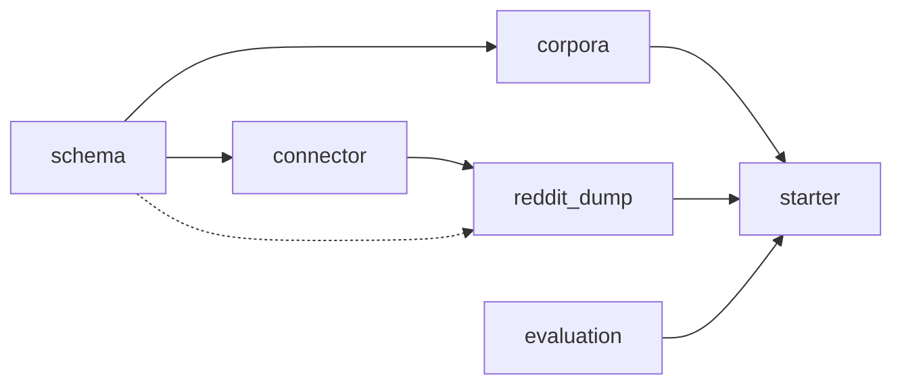

# Kickoff Prep — Discussion Intelligence Toolkit

Advisor-side prep artifacts delivered before the August kickoff. These seed the team's repo and compress the September milestone.

## Files

| File | Purpose |
|---|---|
| `schema.py` | Canonical schema: `Speaker`, `Utterance`, `Conversation`. The stable contract across the toolkit. |
| `connector.py` | Abstract `Connector` interface, exceptions, and base `ConnectorConfig`. |
| `reddit_dump.py` | Reference Reddit connector against filtered Pushshift parquet exports. It is the day-one example, not the only source the architecture should support. |
| `corpora.py` | Loaders for ConvoKit labeled corpora (`CoarseDiscourseLoader`, `CgaCmvLoader`) plus JSONL loaders and leakage-aware splitting helpers. |
| `evaluation.py` | Metric functions, model `Protocol`s (`TextClassifier`, `TextRegressor`, `TextEmbedder`), and evaluation helpers. |
| `starter.ipynb` | Colab-ready notebook for the Reddit reference path: filter a working subset, run the connector, inspect thread structure, load labeled corpora, and measure a baseline. |
| `_build_starter_notebook.py` | Generator script for `starter.ipynb`. Edit notebook content here, then regenerate the notebook. |
| `llm_access_guide.md` | Guide to the LLM synthesis stage using local open-weight models first and API fallbacks second. |

## Dependency chain

## Reference scope

These kickoff artifacts intentionally use **Reddit as the reference connector** because it provides large threaded discussion data and cleanly demonstrates the toolkit design. The downstream contracts should remain source-agnostic. A later contributor should be able to swap in GitHub Discussions, forum dumps, Discord-style exports, or another threaded source without rewriting the schema, evaluation harness, or report format.

## Validation status

These files are kickoff scaffolds, not a published package release. If you promote them into the team repo, add runnable smoke tests beside the modules and wire them into CI before treating them as stable starter infrastructure.

## What students get on day one

After cloning the team repo, fellows can:

1. Open `starter.ipynb` in Colab and run it top to bottom
2. Build a small Reddit reference dataset from filtered Pushshift exports
3. See the connector emit canonical `Conversation` objects end-to-end
4. Inspect thread structure and basic EDA before modeling
5. Load the ConvoKit Coarse Discourse splits and measure a first baseline

Total time from `git clone` to first measured baseline should stay within roughly 30–60 minutes, depending on subreddit frequency in the Pushshift stream and Colab startup conditions.
