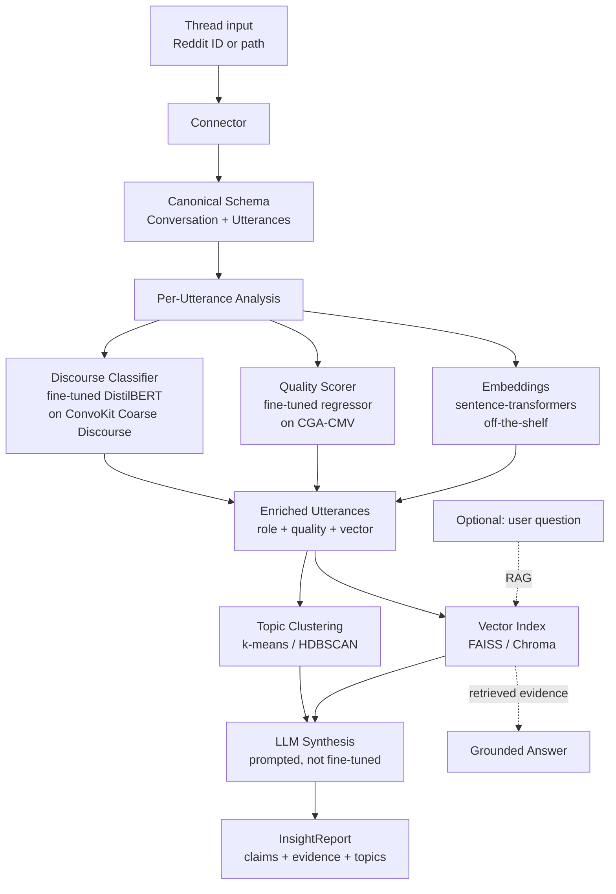

# Discussion Intelligence Toolkit
### An Open-Source Python Library for ML-Driven Insight Extraction from Online Threaded Conversations

*BTT AI Studio — Fall 2026 Challenge Project Proposal*

---

## Overview

Long community discussions on Reddit, forums, GitHub, and similar platforms contain high-value product, research, and operational signal that currently requires hours of manual reading to extract. This workflow does not scale, does not survive team turnover, and is precisely the kind of work modern NLP should be doing.

This project asks fellows to build an open-source Python toolkit — packaged as a pip-installable library with a pluggable connector architecture — that converts threaded online discussions into structured, evidence-linked insight reports. The toolkit combines transformer fine-tuning for discourse classification, embedding-based clustering and retrieval, and retrieval-augmented LLM synthesis to produce reports that name the claims being made in a thread, score their argument quality, group them by topic, and link each one back to the supporting comments.

> **Design driver:** every shape decision is made so fellows walk away in December with something they can install on their own machines, extend, and keep using. The deliverable is a pip-installable Python library, not a notebook.

Discussion intelligence is an active area of practitioner work in the AI engineering space — Granola, Notion AI, Claude Projects, and the broader "AI for your stuff" wave are all variations on this theme. The toolkit produced by this project will be directly usable by the advisor and is structured to remain valuable to fellows as a portfolio artifact long after the program ends.

---

## System Architecture

The toolkit is a multi-stage pipeline. Training happens once on labeled corpora in October; inference runs end-to-end on any new thread the connector ingests, with no per-thread retraining.

Only the discourse classifier and quality scorer involve training. The trained weights ship inside the package and run on every new thread without retraining. Embeddings, clustering, vector indexing, and LLM synthesis all use off-the-shelf models. RAG is built into the inference path for the optional thread Q&A capability, with no additional training required.

---

## Technical Approach

The project covers the full ML lifecycle across multiple problem types in a single coherent system:

- **Text classification** for discourse-act tagging (question, answer, agreement, disagreement, humor, announcement) using fine-tuned DistilBERT
- **Regression** for argument quality scoring using a fine-tuned regression head on the CGA-CMV derailment labels
- **Clustering** for topic discovery using sentence-transformer embeddings with k-means or HDBSCAN
- **Information retrieval** via in-memory vector indexing (FAISS or Chroma) over each analyzed thread
- **Generative AI** for synthesis through prompted LLM calls grounded in retrieved evidence
- **Transfer learning** throughout — DistilBERT and sentence-transformers serve as the pre-trained foundations students fine-tune or adapt

Modeling tooling stays Python-first and student-accessible: scikit-learn for baselines and clustering, Hugging Face Transformers for compact supervised models, sentence-transformers for embeddings, NumPy and Pandas for data handling, and Jupyter on Google Colab as the development environment. Teams may use TensorFlow- or PyTorch-backed Hugging Face workflows, but the package interfaces should remain framework-neutral.

---

## Compute and Resource Budget

The entire project runs on Google Colab's free tier. Two fine-tuning runs are required during the October modeling milestone, both budgeted well below the 12-hour session limit:

| Training run | Dataset size | Model | Estimated time on T4 |
|---|---|---|---|
| Discourse classifier | ~115k utterances (subsetable to 50k) | DistilBERT-base, 3 epochs, batch 16, seq length 128 | 30–60 min |
| Quality scorer | ~43k utterances | DistilBERT-base regression head, 3 epochs | 15–30 min |

Both budgets assume mixed-precision training where available, sequence length capped at 128 (Reddit utterances rarely exceed this), and evaluation passes included. A hyperparameter sweep of 4–6 configurations per task remains comfortably under a 6-hour Colab session. Fellows save checkpoints to Google Drive to survive runtime disconnections.

Inference uses open-weight LLMs running locally on Colab via Hugging Face — Phi-3-mini, Qwen2.5-7B-Instruct, or Llama-3.1-8B-Instruct at int4 quantization. All fit in the T4's 16GB VRAM and produce a thread summary in under a minute. As a fallback for faster iteration during development, the advisor provides free-tier API access (Groq, Gemini, or OpenRouter); fellows never need a paid API key.

If Colab free tier becomes unreliable mid-program, Kaggle Notebooks (30 GPU-hours per week on P100) is the documented backup environment.

No deployment infrastructure is required. No proprietary tooling. No NDAs.

---

## Project Milestones

The architecture is established in August so every later month adds working code into a real package rather than a one-off notebook.

| Month | Phase | Concrete Outcomes |
|---|---|---|
| **August** | Kickoff & architecture | Team intros, Colab + GitHub setup, repo skeleton with CI, canonical thread schema designed (`Conversation`, `Utterance`, `Speaker`), pluggable `Connector` interface specified, first connector (Reddit dump loader) implemented as the reference |
| **September** | Data prep & baselines | EDA on chosen Reddit corpora, schema normalization, train/dev/test splits with temporal hold-out, weak-label generation where useful, simple baseline classifiers and embedding baselines, evaluation harness skeleton checked into the package |
| **October** | Modeling | Fine-tune DistilBERT or another compact supervised model on ConvoKit Coarse Discourse for discourse-act classification; add the CGA-CMV quality scorer; embedding-based topic clustering with sentence-transformers; build the vector index layer; per-task error analysis and metrics dashboard |
| **November** | Integration & packaging | Component models integrated into a single `analyze(thread) → InsightReport` pipeline; LLM synthesis stage with prompted summarization and RAG-grounded thread Q&A; package becomes `pip install`-able; documented extension points; cross-subreddit and temporal hold-out evaluation |
| **December** | Polish & ship | README, usage documentation, demo notebook, final technical report, recorded demo of the toolkit running on a fresh thread end-to-end. Stretch: a second connector (Hacker News dump on Kaggle) shipped to prove the architecture extends. |

---

## Success Metrics

Success is measured at three layers: component, system, and shippability.

**Component metrics** track individual model performance. The discourse classifier is evaluated by macro F1 on the ConvoKit Coarse Discourse held-out split. The quality scorer reports MAE and Spearman correlation against CGA-CMV labels. Topic clustering is assessed via silhouette score plus qualitative coherence review on sampled clusters. RAG retrieval is measured by recall@k on a hand-curated set of thread questions. LLM synthesis is evaluated primarily by claim coverage, evidence-link accuracy, and hallucination rate on manually reviewed held-out threads; string-overlap metrics are optional diagnostics, not the decision metric.

**System metric.** Each team builds a held-out set of ~30 Reddit threads in September with manually written "insight digests." The final pipeline output is scored against these along three axes: claim coverage, evidence linkage accuracy, and hallucination rate. The target is greater than 70% claim coverage with under 10% hallucination rate.

**Shippability metric** — the take-further bar. The package must install cleanly via `pip install -e .` on a fresh Colab runtime. End-to-end run on a new thread must complete in under 60 seconds on free-tier Colab. The README must walk a non-team-member through a working demo in under 10 minutes. The connector interface must be documented well enough that a new contributor could add a second connector in a weekend.

A successful December deliverable is a public GitHub repo with a working pip-installable toolkit, a written technical report justifying modeling choices with measured trade-offs, and a recorded demo. The bar is a real tool with real evaluation — not a polished UI.

---

## Stretch Goals

Each stretch goal extends the toolkit's surface area or adds a research dimension. Roughly increasing in difficulty:

1. **Second connector — Hacker News.** Highest leverage; proves the architecture extends. The HN dataset is available on Kaggle and BigQuery.
2. **Cross-domain generalization study.** Train on one subreddit cluster, evaluate on another. Report degradation as a real finding.
3. **Argument graph extraction.** Build a graph of claim → support → rebuttal across a thread and visualize it.
4. **Active learning loop.** Build a small annotation interface; measure how many labels are needed to recover N% of full-supervision performance.
5. **Agentic synthesis.** Replace the prompted-summary stage with a tool-calling agent that decides which analyzers to invoke per thread. Aligns directly with the BTT curriculum's agent content.
6. **Bias and toxicity audit.** Measure whether the quality models systematically under-rate certain user clusters or linguistic styles.
7. **Third connector — GitHub Discussions or Discord export.** For the team that finishes everything else.

The November packaging milestone is the pass bar. Stretch goals separate strong teams from exceptional ones.

---

## Datasets

The project uses three pre-staged datasets. Fellows do no scraping, no API calls, and no data acquisition work — all datasets are downloaded once at kickoff.

**Pushshift Reddit dumps (Hugging Face)** serves as the primary bulk corpus. The mirrors at `fddemarco/pushshift-reddit` and `fddemarco/pushshift-reddit-comments` (parquet format, last updated February 2025) are subsetted offline to chosen subreddits per team, and the working subset used in notebooks and experiments is kept around or below 1 GB. This is a static bulk download, not an API — there are no rate limits and no live calls.

**ConvoKit Coarse Discourse Corpus** (Cornell NLP) provides approximately 115,000 human-annotated Reddit utterances labeled with discourse acts: question, answer, agreement, disagreement, humor, announcement, and so on. This is the training data for the discourse-act classifier — the supervised signal that Pushshift dumps don't directly provide.

**ConvoKit CGA-CMV (Conversations Gone Awry — ChangeMyView)** provides 6,842 ChangeMyView threads with 42,964 utterances, labeled for whether each conversation derails into rule-violating behavior. This trains and evaluates the argument quality scorer.

The optional external benchmark **UKP Argument Annotated Corpora** (TU Darmstadt) validates argument quality models against human-annotated benchmarks outside Reddit.

All datasets are text-primary with categorical labels (discourse acts, derailment flags, subreddit, post type) and numerical metadata (vote scores, comment depth, timestamps). File formats are parquet for the bulk Reddit corpus, JSON for the labeled ConvoKit datasets, and CSV/TSV for derived working splits. After subsetting, each team's working dataset is under 1 GB. Documentation is publicly available for all sources; the advisor will provide a project-specific data dictionary at kickoff defining the unified canonical schema all sources are mapped into.

The data requires some cleaning and preprocessing by design. Schema normalization, deleted-comment handling, markdown stripping, language filtering, thread reconstruction, and train/dev/test splits with temporal hold-out are part of the September data preparation milestone — the work itself is the learning experience.

No PII is involved. All datasets contain only public usernames already published on a public platform. Pushshift is widely used in academic NLP research; ConvoKit is released by Cornell's NLP lab for academic and research use under terms permitting this kind of project.

---

## Compliance with Program Requirements

The project is Python-only, open source (the deliverable is itself an open-source library), and free of NDAs or proprietary tooling. No web scraping is involved — all data is pre-staged bulk download. The full project runs on free-tier Google Colab with no paid API dependencies.
